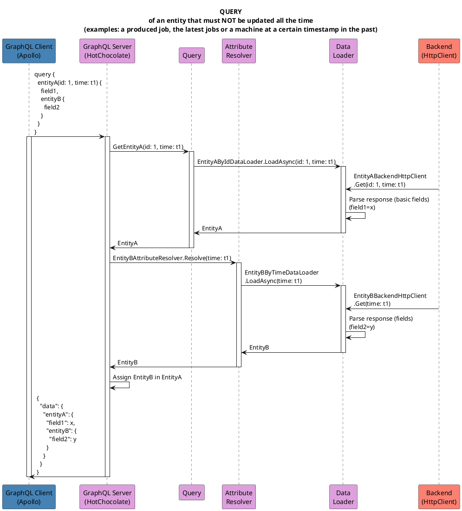

# Data Flow

The **big picture data flow** documentation revolving around the Framework API can be found in the
[OnPremise Architecture chapter](https://lx64ispentw.wuh-intern.de:8080/ISP6/documentation/architecture-documentation/-/blob/master/2_On-Premise_Features/01_General/OnPremise_Architecture.md#data-flow)
of the architecture documentation.

The data flow within the Framework API is shown in the following diagrams:

```plantuml
@startuml
title SUBSCRIPTION\nof an entity that must be updated all the time\n(example: the current status of a machine)

participant GraphQLClient as "GraphQL Client\n(Apollo)" #SteelBlue
participant GraphQLServer as "GraphQL Server\n(HotChocolate)" #Plum
participant Subscription as "Subscription" #Plum
participant SourceStream as "Event\nSourceStream" #Plum
participant AttributeResolver as "Attribute\nResolver" #Plum
participant DataLoader as "Data\nLoader" #Plum
participant ChangeHandlerA as "EntityA\nChange\nHandler" #Salmon
participant CachingServiceA as "EntityA\nCaching\nService" #Salmon
participant CachingServiceB as "EntityB\nCaching\nService" #Salmon
participant HttpClient as "Backend\n(HttpClient)" #Salmon
participant QueueWrapper as "Backend\n(Queue\nWrapper)" #Salmon

GraphQLClient -> GraphQLServer: subscription {\n  entityA(id: 1) {\n    field1,\n    entityB {\n      field2\n    }\n  }\n}
activate GraphQLClient
activate GraphQLServer
GraphQLServer -> Subscription: Subscribe\nEntityA(id: 1)
activate Subscription
Subscription -> SourceStream: Subscribe\nAsync()
activate SourceStream #LightGrey
Subscription -> ChangeHandlerA: EntityAChangeHandler.SubscribeAndSendInitialValue(id: 1)
activate ChangeHandlerA
ChangeHandlerA -> QueueWrapper: Subscribe to all backend data sources\nfor changes that are relevant for EntityA
activate QueueWrapper #LightGrey
activate CachingServiceA
CachingServiceA -> QueueWrapper: Subscribe to EntityA backend\nevents to update/clear caches on changes
CachingServiceA <- HttpClient: EntityA\nBackendHttpClient\n.Get(id: 1)
CachingServiceA -> ChangeHandlerA: EntityA\nbackend\nmodel
deactivate CachingServiceA
CachingServiceA -> CachingServiceA: Cache\nEntityA
activate CachingServiceA #LightGrey
ChangeHandlerA -> ChangeHandlerA: Parse (basic\nEntityA fields)\n(field1=x)
ChangeHandlerA -> SourceStream: SendAsync(EntityA with basic fields)
ChangeHandlerA -> Subscription: void
deactivate ChangeHandlerA
ChangeHandlerA -> ChangeHandlerA: Wait for\nchanges
activate ChangeHandlerA #LightGrey
Subscription <- SourceStream: ReadEvents\nAsync()
Subscription -> GraphQLServer: EntityA with\nbasic fields\n(yield return)
deactivate Subscription
Subscription -> Subscription: Await next event
activate Subscription #LightGrey
GraphQLServer -> AttributeResolver: EntityBAttributeResolver.Resolve()
activate AttributeResolver
AttributeResolver -> DataLoader: EntityBLive\nDataLoader\n.LoadAsync()
activate DataLoader
DataLoader -> CachingServiceB: EntityBCachingServiceB\n.Get()
activate CachingServiceB
CachingServiceB -> QueueWrapper: Subscribe to EntityB\nbackend events to\nupdate/clear caches on changes
CachingServiceB <- HttpClient: EntityB\nBackend\nHttpClient\n.Get()
CachingServiceB -> DataLoader: EntityB backend model
deactivate CachingServiceB
CachingServiceB -> CachingServiceB: Cache\nEntityB
activate CachingServiceB #LightGrey
DataLoader -> DataLoader: Parse\n(EntityB fields)\n(field2=y)
DataLoader -> AttributeResolver: EntityB
deactivate DataLoader
AttributeResolver -> GraphQLServer: EntityB
deactivate AttributeResolver
GraphQLServer -> GraphQLServer: Assign EntityB\nin EntityA
GraphQLServer -> GraphQLClient: {\n  "data":{\n    "entityA":{\n      "field1": x,\n      "entityB":{\n        "field2": y\n      }\n    }\n  }\n}
deactivate GraphQLServer
GraphQLServer -> GraphQLServer: Wait for next\nyield return
activate GraphQLServer #LightGrey
==Some seconds later...==
QueueWrapper -> CachingServiceB: EntityB changed
activate CachingServiceB
QueueWrapper -> ChangeHandlerA: EntityB changed
activate ChangeHandlerA
CachingServiceB -> CachingServiceB: Mark cache\nas dirty
deactivate CachingServiceB
ChangeHandlerA -> ChangeHandlerA: Debounce &\nsync threads
ChangeHandlerA <- CachingServiceA: Get cached\nEntityA
ChangeHandlerA -> ChangeHandlerA: Parse basic\nEntityA fields\n(field1=x)
ChangeHandlerA -> SourceStream: SendAsync(EntityA with basic fields)
deactivate ChangeHandlerA
Subscription <- SourceStream: ReadEvents\nAsync()
Subscription -> GraphQLServer: EntityA with\nbasic fields\n(yield return)
activate GraphQLServer
GraphQLServer -> AttributeResolver: EntityBAttributeResolver.Resolve()
activate AttributeResolver
AttributeResolver -> DataLoader: EntityBLive\nDataLoader\n.LoadAsync()
activate DataLoader
DataLoader -> CachingServiceB: EntityBCachingServiceB\n.Get()
activate CachingServiceB
CachingServiceB <- HttpClient: EntityB\nBackend\nHttpClient\n.Get()
CachingServiceB -> DataLoader: EntityB backend model
CachingServiceB -> CachingServiceB: Cache\nEntityB
deactivate CachingServiceB
DataLoader -> DataLoader: Parse\n(EntityB fields)\n(field2=z)
DataLoader -> AttributeResolver: EntityB
deactivate DataLoader
AttributeResolver -> GraphQLServer: EntityB
deactivate AttributeResolver
GraphQLServer -> GraphQLServer: Assign EntityB\nin EntityA
GraphQLServer -> GraphQLClient: {\n  "data":{\n    "entityA":{\n      "field1": x,\n      "entityB":{\n        "field2": z\n      }\n    }\n  }\n}
deactivate GraphQLServer
==...==
@enduml
```

